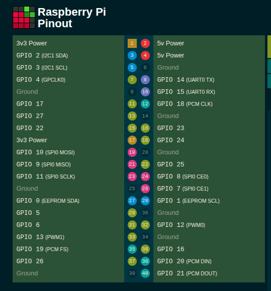

# PL5 - Exercício III: Software PWM (Raspberry Pi 4)

```c
/*
 * dimmer-rpi4.c
 * Programa referente à ficha PL5 – Exercício III
 * Implementação de um Loadable Kernel Module (LKM) para geração de PWM por software no GPIO12
 * Permite controlo do duty cycle (0–100%) através de um character device (/dev/dimmer)
 * Created: 16/04/2026
 * Author : Ines Santos (1140623), André Pinto (1200209) e Gabriel Lopes (1252630)
 */
```

---

## Objetivo

Desenvolver um módulo de kernel para o Raspberry Pi 4 capaz de gerar um sinal **PWM por software** no GPIO12, permitindo controlar o brilho de um LED através de um **duty cycle (0–100%)**.

---

## Funcionamento

* Frequência do PWM: **1 kHz (período = 1 ms)**
* O duty cycle define o tempo em que o sinal está em nível alto:

```
ONTIME  = duty_cycle / 100 × 1 ms
OFFTIME = (1 - duty_cycle / 100) × 1 ms
```

* A geração do PWM é feita na função:

```c
my_timer_func()
```

utilizando **hrtimer** para garantir maior precisão.

---

## Arquitetura

Fluxo do sistema:

```
user → write() → kernel → duty_cycle_setpoint → hrtimer → GPIO12
```

---

## GPIO

* Pino utilizado: **GPIO12**
* Ligação: GPIO12 → resistência (~220Ω) → LED → GND



---

## Compilação

```bash
make
```

---

## Execução

### Carregar módulo

```bash
sudo insmod dimmer-rpi4.ko
```

### Testar PWM

```bash
echo 0   | sudo tee /dev/dimmer
echo 10  | sudo tee /dev/dimmer
echo 50  | sudo tee /dev/dimmer
echo 90  | sudo tee /dev/dimmer
echo 100 | sudo tee /dev/dimmer
```

### Remover módulo

```bash
sudo rmmod dimmer-rpi4
```

---

## Resultados

O LED responde corretamente ao duty cycle:

| Duty Cycle | Comportamento   |
| ---------- | --------------- |
| 0          | OFF             |
| 10         | brilho reduzido |
| 50         | médio           |
| 90         | quase ON        |
| 100        | ON contínuo     |

---

## Conclusão

Foi implementado com sucesso um PWM por software em kernel space, demonstrando:

* controlo direto de hardware
* uso de `hrtimer`
* comunicação user ↔ kernel via character device

---
