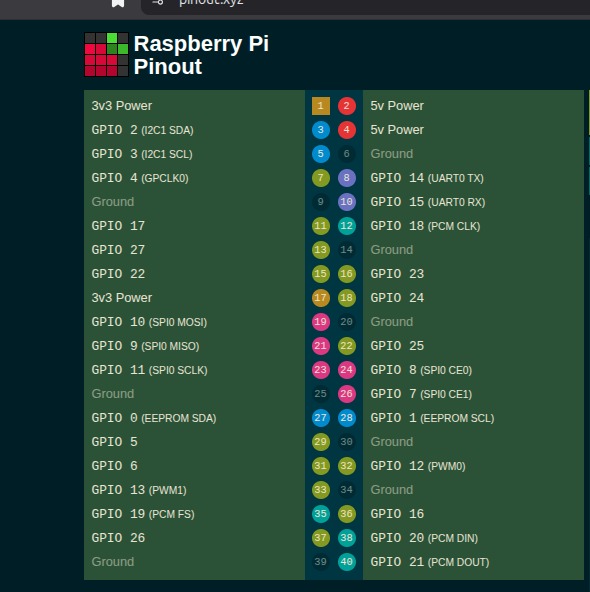

    Entendimento geral


Perceber qual sera o ponto de entrada do modulo quando LKM e carregado pelo kernel. 
NUm programa user-space procura se pelo main ().

Num programa *loadable kernel module*, o racicionio muda: 
- Quem define a funcao de arranque nae e o main.
- Kernel usa macro de registo
- Essa macro liga e o evento "modulo carregado" a uma funcao concreta. 
A funcao executada quando o modulo e carregado e a que aparece dentro de *module_init(...)* 

**Primeiro na folha 5 temos estas perguntas** 

EXERXISE I

    2.1) Which function is executed when thi module is loaded ?

A funcao excutada quando o modulo e carregado e *blinker_init* porque no final do ficheiro aparece module_init(blinker_init);

    2.2) How do you show that this is a character device driver?

atraves da struct file operations, onde tem o principal read write open release. e atraves da funcao blinker_major = register_chrdev(0, MODULE_NAME, &blinker_fops)

ok melhorada : 

1 . register_chrdev(..) -> regista um character device
2. stuct file_operations -> define a interface desse device:
    . open
    . read
    . write
    . release
3. device_create(...) + /dev/blinker | diz nos que ha uma interface no user space. 

    2.3 What is the major number for this device driver ?

blinker_init -> ver o register_chrdev(). Ver de onde vem o major number. O major number e atirubuido dinamicamente. 

    . register_chrdev() devolve o mjaor number atribuido
    . guarda se no blinker_major
    . O kernel imprime esse valor no dmesg

o major number nao esta hardcoded como disse antes, e decidido pelo kernel no runtime.
- major -> identifica a driver
- minor -> identifica as instancias.

    2.4 When is pisca_read function called ? How is that defined? 

pisca_read associoa a blinker_read . 

a cadeia e :

    cat /dev/blinker -> syscall read() -> kernel ve file_operations do driver -> chama blinker_read

A funcao blinker_read e chamada quando um processo executa uma operacao de leitura sobre o ficheirp do device, por exemplo cat /dev/blinker. Isso e definido na estrutura file_operation, atraves do campo . read = blinker_read, que e registado no kernel com register_chrdev(...)

    2.5 When is the pisca_write function called ? How is that defined ?

A função pisca_write é chamada quando um processo executa uma operação de escrita sobre o ficheiro do device, por exemplo echo XXXX > /dev/blinker. Isso está definido na estrutura file_operations, no campo .write = blinker_write, que é registada no kernel com register_chrdev(...).

    2.6 When is the my_timer_func function called ? How is that defined ? 


Nas perguntas 2.4 e 2.5, a função era chamada por uma syscall de user space.
Aqui o modelo mental tem de mudar...

A função my_timer_func é chamada quando o timer do kernel expira. Isso é definido em timer_setup(&my_timer, my_timer_func, 0), que associa my_timer_func ao timer, e em add_timer(&my_timer), que arma o timer para expirar em jiffies + blink_delay. No final da própria função, o timer é novamente armado, tornando a execução periódica.


##############################################################################

No Raspebrry Pi :

    . GPIO e memory-mapped I/O
    . tens de escrever nos registos (SET / CLR) para mudar o pino. 

***PINOUT***




##############################################################################

PL5

Ex II

1) Create a copy of the blinker directory and name it blinker-rpi4. All the following changes will be made in the files in the new directory:

    - cp -a blinker blinker-rpi4
    - cd blinker-rpi4
    - tar xvf linux-6.12-rpi4.tar.xz

2) Assuming the source code is contained in more than one C file, the Makefile must be 
changed accordingly. The kernel module will be named blinker-rpi4.ko and will be built 
from blinker.o and gpio.o (the list of files is specified through the blinker-rpi4-objs 
variable):

Makefile i think

3) Build the module

    entrada: **duty_cycle_setpoint**, inteiro **0...100**

    saida: **GPIO12**

    periodo: **PWM** ***1 ms***

    depois: 

        ONTIME = duty_cycle / 100 * 1ms

        OFFTIME = (1 - duty_cycle / 100) * 1 ms

POR ISSO USAR O blinker_hr porque usa hrtimer -> mais apropriado.    

    frequencia **PWM**: ***1 kHz***


duty_cycle_setpoint  → input do utilizador (0..100)

duty_cycle           → valor usado no ciclo atual

new_period           → flag de estado (1 = início de período)


4) Check the module's version with the modinfo command:

    modinfo blinker-rp4.ko

5) Test the module on the Rasoberry Pi.

6) Remove the module.


##########################################################################################

 Timer 

 my_timer_func -> calcula ON /OFF

 Hardware

 gpio12set(1/0)

 ao fazer o exercicio da para ver os diferentes valores de duty cycle vao dar mais (100) ou menos (0) de duty cycle e briulho no led. 

 echo 0 | sudo tee /dev/dimmer
echo 100 | sudo tee /dev/dimmer
 ###################################################################
 
 
 ## Environment

- Board: Raspberry Pi 4 (BCM2711)
- OS: Raspberry Pi OS
- Kernel: 6.12.75+rpt-rpi-v8

## GPIO

- PWM implemented on GPIO12
- Connected to LED + resistor (~220Ω) to GND

## Build

```bash
make
```

## Load Module / remove

sudo insmod dimmer-rpi14.ko / sudo rmmod dimmer-rpi14.ko

